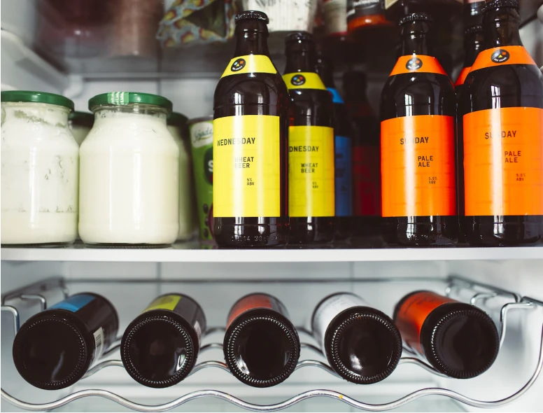

La bière artisanale est devenue très populaire ces dernières années, en grande partie en raison de la qualité supérieure de ses ingrédients et de son processus de production. Les brasseurs artisanaux mettent l'accent sur la fabrication de bières uniques, riches en saveurs et en arômes, ce qui attire les amateurs de bière du monde entier. Cependant, la bière artisanale est également plus délicate et nécessite une attention particulière lors de sa conservation.

Examinerons ensemble les bonnes pratiques pour vous aider à conserver votre bière artisanale de manière optimale.

## L’exposition à la lumière

La lumière est un ennemi de la bière artisanale. Les rayons UV peuvent altérer la saveur et l'arôme de la bière, car ils peuvent briser les molécules de houblon et de malt qui donnent à la bière ses caractéristiques gustatives. Cela peut entraîner une bière ayant un goût "cuit" ou un arrière-goût désagréable.

Pour éviter l'exposition à la lumière, il est important de stocker la bière dans un endroit sombre, comme un placard, une cave ou plus simplement un frigidaire.Les bouteilles de bière en verre foncé sont souvent préférées car elles offrent une protection supplémentaire contre la lumière.

## Le stockage vertical ou horizontal

La position de stockage de la bouteille peut également affecter la qualité de la bière. Les bouteilles de bière doivent être stockées à la verticale ou à l'horizontale en fonction de leur type de bouchon.

Les bouteilles de bière avec des bouchons en liège doivent être stockées à l'horizontale pour que le bouchon reste humide et ne se dessèche pas, ce qui pourrait entraîner une contamination de la bière ou libérer le gaz carbonique et donner une bière plate. 

Les bouteilles avec capsule sont, si vous avez la place, à stocker à la verticale pour éviter le contact de la bière avec la capsule qui peut donner un goût métallique. 

Il est important de noter que si vous stockez votre bière à l'horizontale, vous devrez la laisser reposer à la verticale pendant quelques heures avant de l'ouvrir pour permettre aux sédiments de se déposer au fond de la bouteille.

## La température de conservation

La température est l'un des facteurs les plus importants à prendre en compte pour conserver la bière artisanale. La bière doit être conservée dans un endroit frais, à une température comprise entre 4 et 14°. Des températures plus élevées peuvent accélérer le processus de vieillissement de la bière, ce qui peut entraîner une oxydation prématurée et altérer le goût et l'arôme.

La température de stockage optimale pour chaque type de bière peut varier légèrement. Les bières légères doivent être conservées à une température plus froide que les bières brunes et fortes, qui peuvent être conservées à une température plus élevée. 
 Il est important de noter que la température idéale de conservation pour chaque type de bière peut également varier en fonction de la marque et du producteur, il est donc recommandé de consulter les informations de conservation spécifiques fournies par chaque brasseur.

## La durée de conservation

Le choix du contenant de bière affecte la durée de conservation de la bière. Les bouteilles en verre foncé peuvent être utilisées pour une durée de conservation allant jusqu'à six mois, tandis que les canettes en acier inoxydable peuvent être utilisées pour une durée de conservation allant jusqu'à un an.

Le style des bières influence aussi sur la durée de conservation :
- Les IPA peuvent être conservées 3 mois
- Les Pale Ale 4 mois
- Les Stout et Porter jusqu’à 6 mois

Au delà, la bière est toujours buvable sans risque pour la santé, mais les arômes et [le goût risquent de se détériorer](/blog/8-defauts-et-faux-gout-biere-artisanale-les-plus-frequents/).

D’une manière générale, les bières légères (moins de 5°) se consomment rapidement, autrement dit moins de six mois après la mise en bouteille. Les bières plus alcoolisées, les barley wine ou encore les geuzes peuvent se conserver plus longtemps. Au bout de quelques années, elles gagneront même en moelleux. L’important c’est de faire confiance à votre brasseur et de garder en tête tous ses conseils !

En conclusion, avec les bonnes pratiques vous pourrez profiter d'une bière artisanale de qualité supérieure pendant des mois après son brassage.