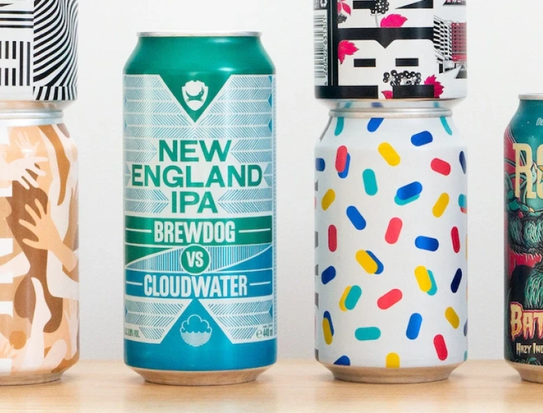

La bière en canette a longtemps été décriée. La fameuse “8.6” n’a surement pas aidé. Aujourd’hui cependant, les brasseries sont de plus en plus nombreuses à conditionner leur bière en canettes. Procédons étape par étape pour comprendre pourquoi.

## 1. Le goût

Commençons avec le plus important bien sûr, le goût !

Maintenant, on peut le dire : Il n’y a aucune différence de goût entre les deux contenants.

Contrairement à la légende urbaine, l’aluminum de donne aucun goût à la bière. De plus, un revêtement plastique est collé sur la paroi intérieure et empêche au breuvage tout contact avec le métal. Après tout, le thon en boite n’a pas le goût de métal. 🤷

## 2. La fraicheur

Après avoir parlé de goût, parlons service de bière bien fraîche.

La canette est plus fine et donc plus sensible aux changements de températures. Ça peut être un inconvénient mais aussi un avantage ! Il faut savoir que la canette se refroidit jusqu'à **280 fois plus vite que la bouteille**. Un petit tour au congélateur et votre bière sera bien plus vite rafraichie.

**Astuce :** si des visiteurs arrivent à l'improviste, vous prenez vos canettes, vous les emballez dans un essuie-tout humidifié, vous les mettez au congélateur. Le temps de saluer et d'installer tout le monde, vous allez rechercher vos canettes et elles sont idéalement fraîches !

## 3. La conservation

Quand on parle conservation de la bière, il y a deux grands ennemis : **l’air et la lumière**.

La canette est scellée ce qui rend le contenant **totalement hermétique**, ce qui n'est pas toujours le cas avec la bouteille. Un peu d'oxygène peut parfois passer par la capsule, si elle a été mal positionnée ou si elle est de mauvaise qualité. Donc pas de risque d'oxydation de la bière en canette !

Pour la lumière, la bouteille est teintée pour ne pas laisser passer les rayons UV de la lumière. Mais la canette étant **totalement opaque**, aucune chance que la lumière ne dégrade la bière.

## 4. Le Design

La canette de bière est souvent vue comme moins esthétique que la bière en bouteille par le consommateur non-avertis, mais la canette et sa forme cylindrique permet une surface d’expression artistique à 360°.

De nombreux brasseurs collaborent d’ailleurs avec des artistes pour la création des designs et certaines canettes sont tellement belles qu’on hésite à les jeter !

## 5. Le stockage

En plus d'être **résistantes** en position verticale, les canettes peuvent s'empiler les unes sur les autres et ainsi faire une économie considérable sur la place qu'elles occuperaient si elles étaient des bouteilles. En terme de transport, tout le monde y trouve facilement son compte, d'autant plus que le poids moyen d'une canette est de 14 grammes, lorsque celui d'une bouteille est de 250 grammes.

Côté vendeur : sur un carton de 24, cela fait une différence d'environ 7 kilos. Donc, à la fin de la journée, cela vaut la peine d'avoir manutentionné des canettes plutôt que des casiers de bière ! 

Côté consommateur : la canette est plus pratique. Vous la mettez dans votre sac à dos pour le pique-nique ou la rando. Quand elle est vide, vous l'écrasez et vous la remettez dans le sac à dos. Et pas besoin de décapsuleur !

La canette là encore, est plus optimisée et sort gagnante.

## 6. L’impact écologique

La canette en alu est plus écologique !

Les canettes sont fabriquées à partir d’aluminium, et donc recyclables à volonté.

Le verre aussi peut être recyclé, mais pour recycler il faut des usines. Le point de fusion du verre se situe entre 1000 et 1600 degrés, celui de l’aluminium à seulement 650 degrés. Le recyclage des canettes est donc moins énergivore. 

Elle est aussi plus légère, et sa forme mieux optimisée. Sur une palette classique, là où on met 50 à 70 casiers de bière, on peut monter à 120, 130 cartons de canettes. En théorie, il est donc possible d’économiser la moitié des transports pour la même quantité de bière. 

On peut argumenter en faveur des bouteilles réutilisables, qui sont plus épaisses que les bouteilles classiques. Elle ont d'ailleurs 1% d'aluminium dans leur mélange pour les rendre plus résistantes. Mais les bouteilles réutilisables ont besoin d'être lavées, ce qui a un coût non-négligeable en eau, et ont une duré de vie d'environ 30 utilisations avant de finir cassées.

## Conclusion

La canette en aluminium présente de très nombreux avantages comparé aux bouteilles en verre.

Il y a toutefois des choses qu'on ne peut pas faire avec la canette, comme la refermentation. La bouteille reste aussi le meilleur contenant pour certains types de bière, comme les bières de garde. La bouteille de 75cl est aussi bien plus conviviale pour partager sa bière entre amis.

Le plus simple et écologique reste encore la bière pression. Les fûts sont en aluminium et peuvent être réutilisés pendant plusieurs dizaines d’années.

Une raison de plus pour aller au bar ! ;D