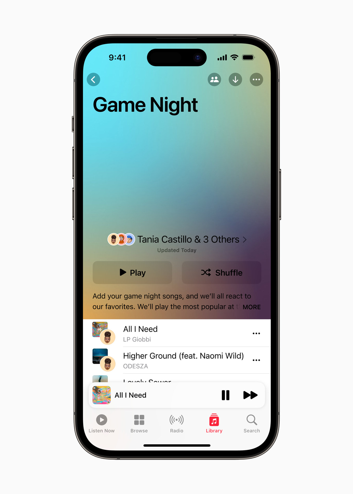



CUPERTINO, CALIFORNIE Apple a annoncé aujourd’hui la sortie de nouveaux logiciels et technologies qui permettront aux développeurs de créer des apps révolutionnaires pour [Apple Vision Pro](apple.com), le tout premier ordinateur spatial d’Apple. Avec visionOS, le premier système d’exploitation spatial au monde, les utilisateurs de Vision Pro peuvent interagir avec les contenus numériques comme s’ils étaient réellement présents dans leur espace, et ce de façon extrêmement intuitive et naturelle, c’est-à-dire avec leur voix, leurs mains et leurs yeux. Dès aujourd’hui, la communauté de développeurs Apple va pouvoir exploiter l’informatique spatiale et l’espace illimité offert par Apple Vision Pro pour créer une toute nouvelle catégorie d’apps qui intègreront de façon fluides des contenus numériques au monde réel, donnant ainsi naissance à des expériences aussi inédites que magiques. Le SDK visionOS met à la disposition des développeurs les capacités puissantes et uniques de Vision Pro et de visionOS pour concevoir des apps offrant des expériences innovantes dans un large éventail de catégories, notamment pour la productivité, le design et les jeux.

Le mois prochain, Apple ouvrira des laboratoires de développement à Cupertino, Londres, Munich, Shanghai, Singapour et Tokyo où les développeurs pourront directement tester leurs apps sur Apple Vision Pro et obtenir l’aide des ingénieurs Apple. Des kits seront également proposés aux équipes de développement pour créer, itérer et tester leurs apps directement sur Apple Vision Pro.

« Apple Vision Pro redéfinit ce qu'il est possible de faire sur une plateforme informatique. Pour se lancer dans la création d’apps visionOS, les développeurs peuvent se reposer sur les puissants frameworks qu’ils maîtrisent déjà, et ils pourront aller encore plus loin grâce à des technologies et des outils innovants, comme Reality Composer Pro, pour concevoir des expériences inédites », a déclaré Susan Prescott, Vice president of Worldwide Developer Relations d’Apple. « L’informatique spatiale exploite l’espace autour de l’utilisateur, ce qui représente de nouvelles possibilités pour les développeurs, qui peuvent ainsi imaginer de nouvelles façons d’échanger, de travailler et de se divertir. Nous avons hâte de découvrir ce que notre communauté de développeurs va créer. »



Pour créer de nouvelles expériences qui tirent parti des fonctionnalités révolutionnaires d’Apple Vision Pro, les développeurs peuvent exploiter les mêmes frameworks fondamentaux qu’ils utilisent déjà sur les autres plateformes Apple, notamment Xcode, SwiftUI, RealityKit, ARKit et TestFlight. Avec ces outils, ils peuvent créer de nouveaux types d’apps offrant une véritable expérience d’immersion via différents aspects : des fenêtres, qui affichent de la profondeur et peuvent présenter du contenu en 3D ; des volumes, qui créent des expériences visibles sous n’importe quel angle ; et des espaces, grâce auxquels l’utilisateur est totalement immergé dans un environnement affichant un contenu en 3D illimité. 

Pour aider les développeurs à optimiser le contenu 3D de leurs apps et jeux visionOS, Xcode propose un tout nouvel outil, Reality Composer Pro, pour la prévisualisation et la préparation de modèles 3D, d’animations, d’images et de sons parfaitement compatibles avec Vision Pro. Le nouveau simulateur visionOS offre également aux développeurs la possibilité d’interagir avec leurs apps et d’essayer plusieurs agencements et éclairages de pièce. Enfin, chaque framework intègre la prise en charge des fonctionnalités d’accessibilité innovantes d’Apple, afin que les apps visionOS et d’informatique spatiale puissent être utilisables par tous.

Dès le mois prochain, les développeurs de jeux et d’apps Unity en 3D pourront réaliser le portage de leurs créations sur Apple Vision Pro et en exploiter les puissantes capacités.

Les développeurs qui ont déjà eu l’occasion de découvrir le SDK et les API visionOS sont enthousiasmés par les possibilités de la plateforme et par les nouvelles expériences qu’elle offrira à leurs utilisateurs :

« **Complete HeartX** sur Apple Vision Pro va former les étudiants en médecine à la pratique clinique grâce à des animations et des modèles en 3D hyper réalistes qui les aideront à mieux comprendre et visualiser les problèmes de santé, comme la fibrillation ventriculaire, et ainsi à mieux utiliser ces connaissances pour soigner leurs patients », a déclaré Jan Herzhoff, président d’Elsevier Health. « Complete HeartX sur Apple Vision Pro va révolutionner la formation médicale et mieux préparer les futurs professionnels de santé. »

Le SDK visionOS, la version mise à jour de Xcode, Simulator et Reality Composer Pro sont accessibles aux membres de l’Apple Developer Program sur [developer.apple.com](developer.apple.com). Les développeurs Apple enregistrés auront accès à différentes ressources pour les guider dans la conception, le développement et les tests de leurs apps pour Apple Vision Pro, notamment une documentation technique complète, de nouveaux kits de conception, et de nouvelles directives en matière d’interface pour visionOS.

Pour en savoir plus sur la conception d’apps pour Apple Vision Pro, ou pour demander un kit de développement dès le mois prochain, les développeurs peuvent consulter [developer.apple.com/visionos](developer.apple.com/visionos).
