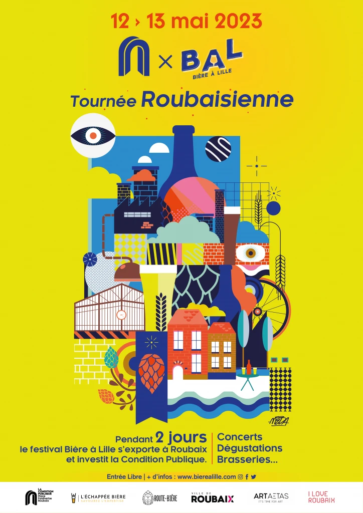
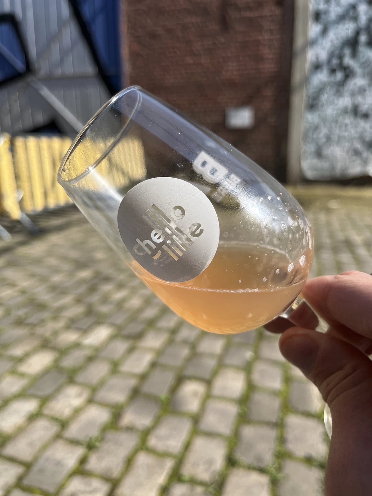

Le festival Bière à Lille, ou BAL pour les initiés a fait un arrêt à la condition publique de Roubaix, l’occasion de découvrir 5 brasseries roubaisiennes et 5 brasseries de la région invitées pour l’occasion !

Le festival s’est déroulé du 12 au 13 mai, et pendant deux jours de nombreuses activités étaient proposées : concerts, brassin collaboratif, dégustation, animations, exposition… 

Chacune des 5 brasseries roubaisiennes a eu l’opportunité d’inviter une brasserie amie, l’occasion de découvrir toujours plus de brasseurs talentueux de la région !

Vous pouvez consulter la liste des brasseries présentent au festival sur le site de [Bière à Lille](https://www.bierealille.com/bal-tournee-roubaisienne/).

Comme vous le savez peut-être, le 12 mai c’est le jour de mon anniversaire ! J’ai donc eu l’occasion d’aller y passer l’après-midi (jusque très tard) pour déguster les bières proposées par les 10 brasseries participantes.  
J’ai aussi eu l’occasion de discuter avec les brasseurs, acheter quelques bières et échanger avec Olivier Malcurat, animateur du podcast “[Le Pod’capsuleur](https://podcast.ausha.co/podcapsuleur)” que j’écoute religieusement à chaque nouvel épisode.

C’était mon premier festival autour de la bière craft, le beau temps était présent et j’avais une excuse pour boire, c’était donc un très bon moment que je vous recommande ! (J’ai même fait une apparition en storie instagram du BAL 😎)